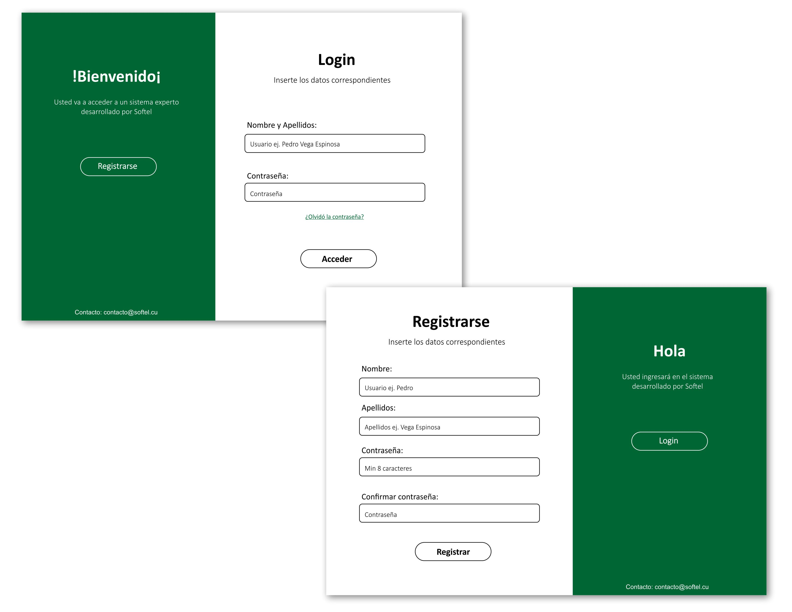
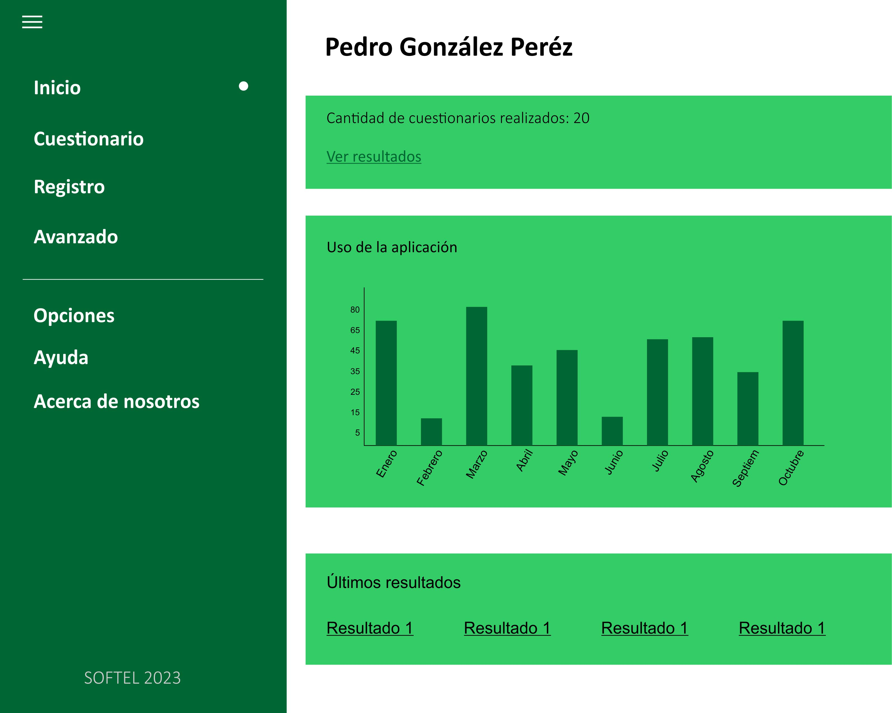
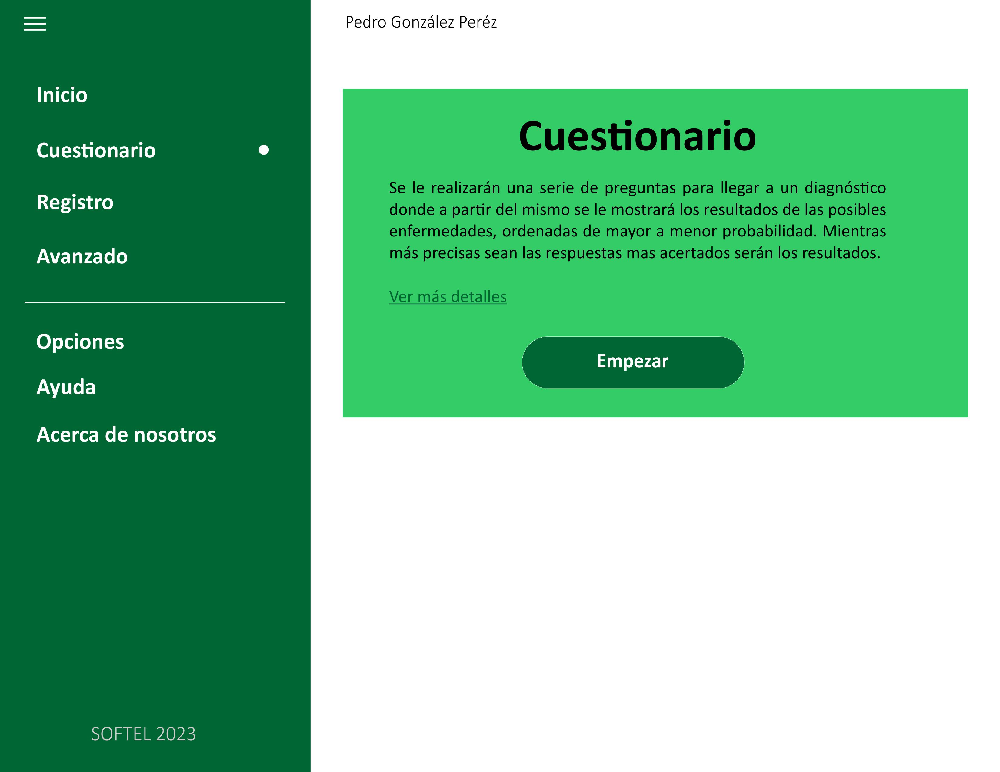
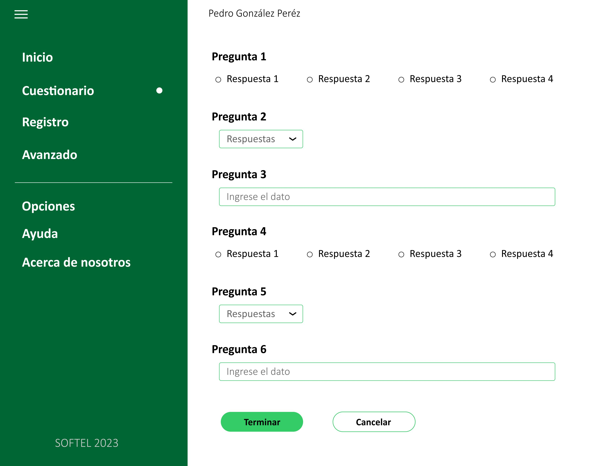

# SEAA - Sistema Experto como Aplicación SaaS

**SEAA (Sistema Experto como Aplicación Autónoma)** es una plataforma web desarrollada como Software como Servicio (SaaS) para la gestión y alojamiento de aplicaciones de sistemas expertos en el área de medicina. Permite la interacción con múltiples aplicaciones de inteligencia artificial médica a través de comunicación XML, ofreciendo herramientas de monitoreo, visualización de resultados, gestión de usuarios y análisis de uso.

## Prototipos
<div>
  &nbsp;&nbsp;&nbsp;
  &nbsp;&nbsp;&nbsp;
</div> 
.
<div>
  &nbsp;&nbsp;&nbsp;
  &nbsp;&nbsp;&nbsp;
</div>

---

## 🚀 Características principales

- 🧠 **Ejecución de Sistemas Expertos en Medicina**  
  Integración con aplicaciones de IA mediante intercambio XML y ejecución en consola.

- 📊 **Visualización de Datos y Estadísticas**  
  Dashboards con gráficos, resúmenes e historial de ejecuciones.

- 🧾 **Gestión de Usuarios y Seguridad**  
  Integración con OAuth2, control de accesos y roles mediante Spring Security.

- 🪵 **Sistema de Logs**  
  Seguimiento detallado de eventos y operaciones del sistema.

- 🧱 **Arquitectura basada en buenas prácticas**  
  Desarrollado con metodologías ágiles (Scrum), principios SOLID, e integración de herramientas modernas para backend y frontend.

---

## 🛠️ Tecnologías Utilizadas

### Backend
- **Lenguaje:** Java 17  
- **Framework:** Spring Boot 3.1.5  
- **Persistencia:** Spring Data JPA  
- **Seguridad:** Spring Security + OAuth2 + JWT  
- **Base de Datos:** PostgreSQL  
- **Logs:** Logback + integración XML/Consola  
- **Ejecución de IAs:** Comunicación por XML y ejecución vía consola  
- **Otros:** JJWT para gestión de tokens, Aspose PDF para generación de documentos, Junrar para extracción de archivos

### Frontend
- **Framework:** Angular 16  
- **Estilo:** Bootstrap 5.3.2 + Angular Material  
- **Gráficos:** Chart.js + ng2-charts  
- **Animaciones y UI:** Angular CDK, Material Icons  
- **Seguridad:** Gestión de tokens JWT en cliente

---

## 🧪 Testing y Calidad
- **Backend:** Spring Boot Test, Spring Security Test  
- **Frontend:** Jasmine, Karma  
- **Validación:** Spring Boot Validation  

---

## 🧩 Arquitectura General

El sistema sigue una arquitectura **modular basada en capas**, separando claramente la lógica de negocio, acceso a datos y presentación. Se favorece la mantenibilidad y la extensibilidad, permitiendo agregar nuevos sistemas expertos fácilmente.

- **Capa Web (Angular)**: visualización, interacción y formularios
- **Capa API (Spring Boot)**: lógica de negocio y comunicación con el sistema experto
- **Capa de Infraestructura**: persistencia en PostgreSQL, gestión de archivos, logs y ejecución de procesos externos

---

## 🧑‍💻 Estructura del Proyecto

### Backend (`seaa`)
- `src/main/java/com/softel/seaa`: Código fuente
- `src/main/resources`: Configuración y plantillas
- `pom.xml`: Dependencias Maven

### Frontend (`app-softel`)
- `src/app`: Componentes, servicios, módulos
- `angular.json`, `package.json`: Configuración y dependencias

---

## 📈 Funcionalidades destacadas

- Registro e inicio de sesión con seguridad OAuth2
- Panel administrativo y gestión de usuarios
- Carga de archivos para ejecución de sistemas expertos
- Ejecución y comunicación con motores expertos vía XML
- Generación de PDFs y resúmenes de diagnósticos
- Dashboard con métricas y visualización de estadísticas
- Historial detallado de ejecuciones con filtros

---

## 🔄 Metodología de Desarrollo

El desarrollo se realizó bajo la metodología **Scrum**, incluyendo:

- Definición de historias de usuario
- Sprints iterativos
- Reuniones de planificación, revisión y retrospectiva
- Documentación técnica y de usuario
- Pruebas funcionales y unitarias

---

## 🗄️ Base de Datos

- **Motor:** PostgreSQL 15.1
- **Diseño:** Normalizado y documentado
- **Gestión de versiones:** Scripts SQL y migraciones

---

## 📦 Instalación

### Requisitos
- Java 17
- Node.js 20
- PostgreSQL 15+
- Maven 3.8.7
- Angular CLI 16.2.6

### Backend
```bash
cd seaa
./mvnw spring-boot:run
```
### Frontend
```bash
cd appSoftel
npm install
ng serve
````
